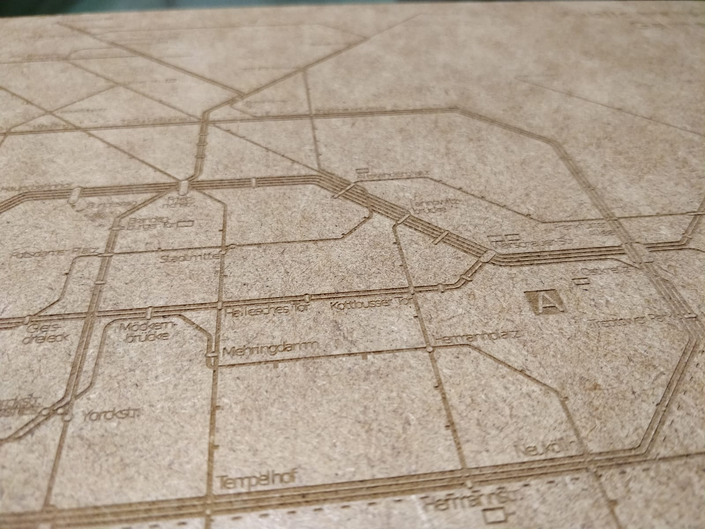

# Endstation

Open Source Public Transport Game developed at Science Hack Day Berlin 2018 

- no code, all analog (for now ;) )
- here you will finde all you need to play the game: the rules, board, pawns and cards

## Game development

The rules of the game are detailed in the  file.

## Assets

Assets include cards and the playing board.

### Cards

Card prototypes can be found in [this file](./Assets/Spielkarten_prototyp.pdf)

### Board map

The playing board was created from an official Berlin transport map
at [this page](http://www.bvg.de/de/Fahrinfo/Downloads/BVG-Liniennetz).

A PDF image was imported in  and simplified to
fit the needs of the game.

A monochrome version was used to engrave the board using a laser cutter.

